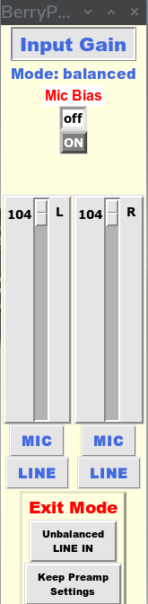

# BerryPreamp
BerryPre is a preamp controller for the HiFiBerry DAC Plus ADC Pro and the HiFiBerry DAC2 Plus ADC Pro audio HAT for the Raspberry Pi computer. It is written in 64bit Python 3.12 and RaspberryPi OS (64Bit).

This version is provided as a binary file compiled with Pyinstaller which integrates the necessary version of Python and added modules.

The Python script is in the folder 'Python Script' and should run with your local Python3 version, but may need additional modules to be installed. 

## Introduction

The preamp is only required for **Balanced** mode working. In unbalanced mode, the left and right channels are in **Line In** mode and are connected via the 3.5mm socket.

**Balanced Mode** input is via the 6-pin (3 x 2) J4 pin-header.
### Pin Header J4

   | Connection | Pin    | Connection    |   
   | ---: | :---:  | :--- |
   | in R- | **1**_**2** | in R+ |
   | GND | **3**_**4** | GND |
   | in L+ | **5**_**6** | in L- |

The most flexible arrangement is to wire J4 to two combi XLR sockets for the left and right channels so that either a balanced 6.35mm (¼") jack plug lead or a balanced XLR  lead may be used for either channel. 

The interface can be used for unbalanced working by using an XLR lead with the -ve connection wired to the GND pin. 'Stereo'  ¼" jackplug leads can be wired in the same way, but mono ¼" leads can be used without modification for keyboards with unbalanced outputs. Keyboard channels should be set to **Line In** gain.

## The Program

Starting the program puts the DAC Plus ADC Pro into Balanced mode, but no other settings are changed. Mic Bias and the channel gains are at the settings when the program was started.

### The Preamplifier Window

There are two 'Exit' buttons at the bottom of the Window. 

'Unbalanced Line In' sets the DAC Plus ADC Pro to **Unbalanced** mode, **Line In** gain and **Mic Bias** to 'OFF'.

'Keep Preamp Settings' exits the program leaving the displayed settings unchanged. Having set up the Left and Right channels to the required settings, there is no need to keep the preamplifier window open while recording takes place.

Once recording is completed, the program can be restarted and exited in **Unbalanced** mode.

## Mic Bias

The Mic Bias control turns red when it is ON. It also reminds you that the two jumpers, J1 (for the L channel) and J3 (for the R channel) are also required. The bias jumpers introduce a small amount of cross-talk between left and right channels. Electrets are omnidirectional both for gain and for frequency response and this crosstalk only results in a slight narrowing of the stereo field which can be restored with a DAW plugin. 

Dynamic micrpphones do not require bias and are usually cardioid in response (heart shaped) with most gain directly in front of the microphone. The differences in polar frequency response together with the crosstalk can cause audio quality problems. **Only apply jumpers J1 and J3 and Mic Bias when you are using electret microphones.**
 
## Gain

There are faders for Left and Right gain. There are preset buttons beneath each fader for **Line Level** and **Mic Level**.

## Installation

Copy the binary file *berrypreamp* and the icon file *HiFiBerry_icon.png* to a folder in your home folder such as,

~/opt/BerryPreamp

Then, *Applications Launcher:* Accessories/Menu Editor

Add a new item in the *Sound and Video* group called BerryPreamp and browse to the file *berrypreamp* in your home directory. Click on *Properties* in the Menu Editor and click on the icon. Browse to the file *HiFiBerry_icon.png* in your home folder and select it. Close Menu Editor. BerryPreamp should now be available in the Sound and Video section of your Application Launcher.
 
## The Python Script

The Python script is provided so that you can see how the program works and make changes if you want.
